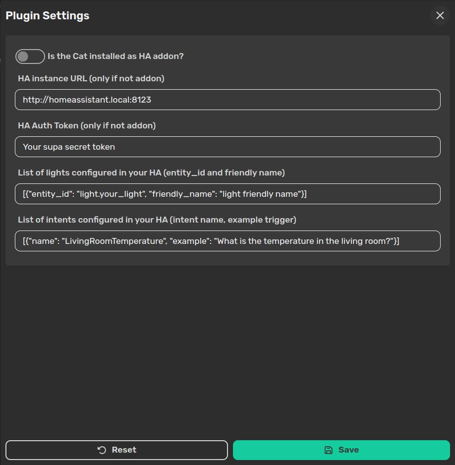
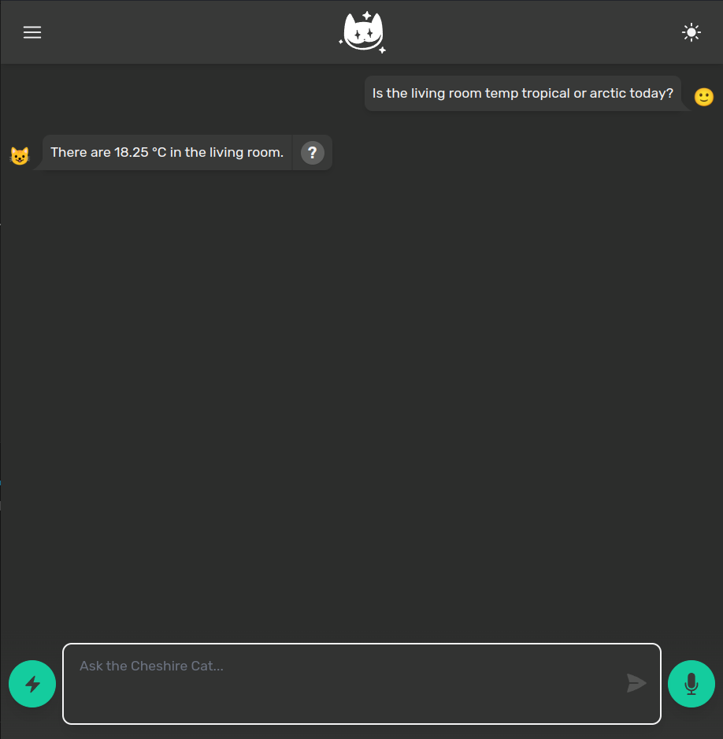

# HA Agent - Let the Cat Manage your Home Devices
 


[](https://)

HA Agent is a Cheshire Cat plugin that connects the Cat to your Home Assistant instance,
letting you embrace the power of LLMs to control your home devices with natural language.

## Configuration

Once you have installed the plugin through the Cheshire Cat admin panel, you need to do some configuration before talking to the Cat.

First of all, you can choose whether the plugin is working in a HA addon environment. If this is true you don't need to configure the HA instance URL and HA Auth Token because the plugin will handle the communication with Home Assistant directly.
Otherwise, be sure to point to your HA installation (e.g. http://homeassistant.local:8123) and to provide a valid token to authenticate requests to Home Assistant APIs.

Now it's time to choose what services and entities you want the Cat to be able to control.

### Available integrations

The HA Agent plugin is meant to provide a flexible and complete integration with Home Assistant, to achieve that, service/domain specific tools needs to be developed. 
Currently there are three available integrations:

 - <b>State Form</b>: a configurable form to get or set the state of a given entity. You only need to provide the entity id you want to retrieve and a friendly name for it. Please note: Setting the state via the HA API does not enable communication with the device; it merely updates the device's representational state within HA. However, this action may still trigger automations. The <a href="https://developers.home-assistant.io/docs/api/rest/">official docs</a> recommend using service endpoints to talk to devices. We're planning to add a specific integration for this soon!

 - <b>Intent Form</b>: a configurable form to handle all the intent scripts in your HA configuration.yaml file. You only need to provide the name of the intent script and an example of a trigger sentence.

 - <b>Shopping List</b>: this integration is designed to facilitate access to a comprehensive range of HA APIs associated with the shopping list service. Its architecture predominantly leverages Cheshire Cat tools, diverging from the conventional forms-based approach of other integrations. It enables users to effortlessly add, remove, mark items as complete or incomplete, or retrieve the entire shopping list.

 - <b>Light Form</b>: a configurable form to handle all the light entities in your HA environment. You only need to provide the entity id of your light and a friendly name of it, so that the agent could easily localized the correct light in your house.

### Examples

Here is an example of the Intent Form integration:

- Once you have installed the HA Agent plugin, you have to provide some settings in the admin panel of your Cat instance. In the list of intents
you should provide an object with name (the actual name of your intent script) and an example (a trigger sentence for that specific intent).

E.g. one could have a temperature sensor and an intent script to read it. So in your HA configuration.yaml:

```YAML
intent_script:
  LivingRoomTemperature:
    speech:
      text: "There are {{ states('sensor.living_room_temperature') }} °C in the living room."
```

Given that intent script configuration, the plugin settings should look like:



You got it! Now it's time to ask the Cat to trigger that action!



## Contributing

The HA Agent plugin is still under active development, we're testing out different approaches and tricks to enhance the performance of the integration. The road to a complete and really useful integration is quite long, so if you have any suggestion or tips to improve the system please open a discussion in this repo or feel free to send a PR.

